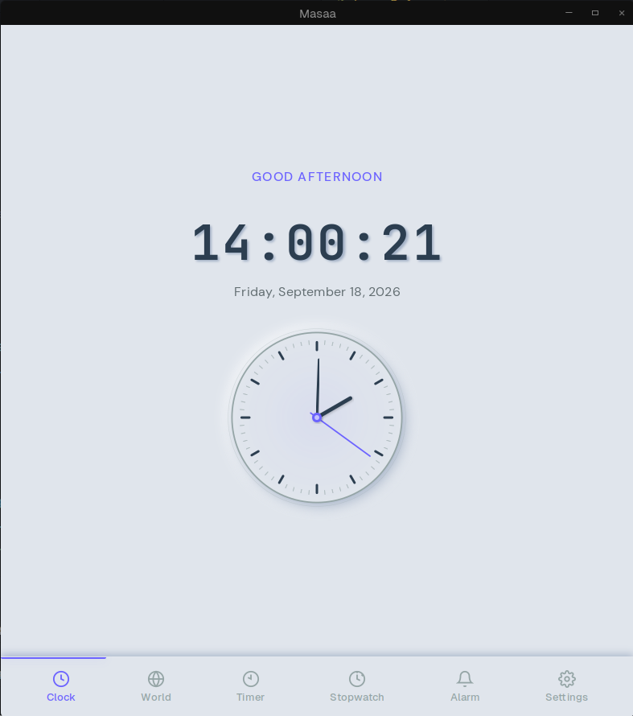

# Masaa

A beautiful, native Linux desktop clock application built with Tauri 1, Vue 3, and Vite.



## Features

- **World Timezone** — Add, search, and compare timezones across teams
- **Alarm Management** — Create, edit, and schedule alarms with recurring support
- **Countdown Timer** — Up to 3 concurrent timers
- **Stopwatch** — With lap tracking
- **Daylight-Adaptive Theming** — UI adjusts to the time of day automatically
- **Custom Alarm Tones** — Import your own MP3/WAV/OGG files
- **System Tray** — Runs in the background, stays out of your way

## Tech Stack

- **Frontend:** Vue 3 (Composition API, `<script setup>`) + Vite
- **Backend:** Rust via Tauri 2
- **Styling:** Neumorphic soft UI
- **Bundles:** `.deb` and `.AppImage`

## Getting Started

### Prerequisites

- Node.js 20+
- Rust (via [rustup](https://rustup.rs/))
- Linux system dependencies:

```bash
sudo apt-get install -y \
  libwebkit2gtk-4.1-dev \
  libgtk-3-dev \
  libappindicator3-dev \
  librsvg2-dev \
  patchelf \
  libssl-dev
```

### Development

```bash
npm install
npm run tauri:dev
```

### Build

```bash
npm run tauri:build
```

Output binaries are located in `src-tauri/target/release/bundle/`.

## Release

Releases are built automatically via GitHub Actions when a version tag is pushed:

```bash
git tag v0.1.0
git push origin v0.1.0
```

Artifacts (deb, AppImage, dmg, exe, msi) are uploaded to the GitHub Release page.

## Project Structure

```
masaa/
├── src/              # Vue 3 frontend
├── src-tauri/        # Rust backend (Tauri)
├── public/           # Static assets
├── docs/             # Documentation
└── .github/workflows # CI/CD (build on release tags)
```

## License

MIT
